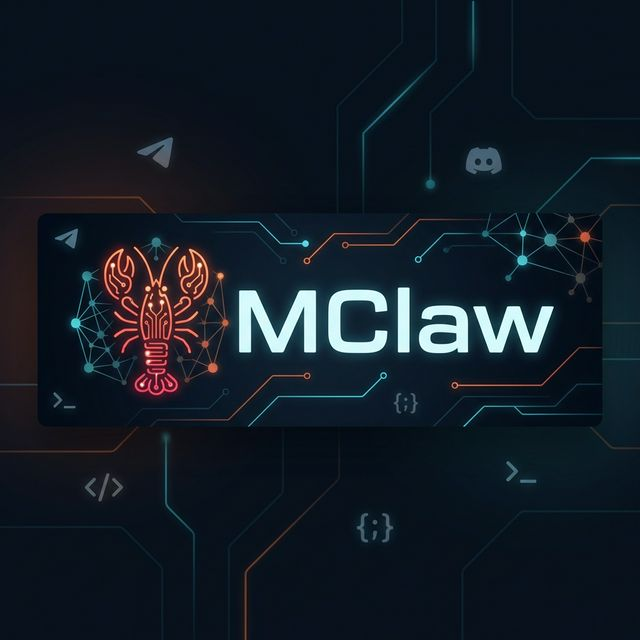
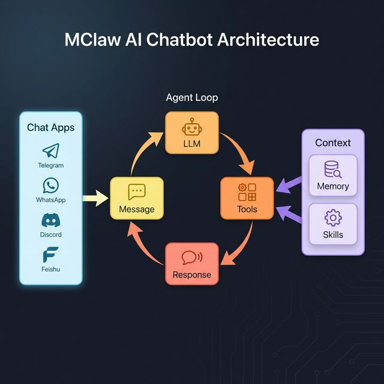

<p align="center">
  
</p>

<h1 align="center">🦞 MClaw</h1>

<p align="center">
  <b>Ultra-lightweight personal AI assistant</b> inspired by <a href="https://github.com/openclaw/openclaw">OpenClaw</a>, built on <a href="https://github.com/sipeed/picoclaw">PicoClaw</a>.<br>
  Multi-channel · Multi-LLM · Intelligent Memory · Single Go binary.
</p>

<p align="center">
  
  
  
  
</p>

<p align="center">
  
  
  
  
</p>

---

## ✨ Features

| Feature | Description |
|---------|-------------|
| 🌐 **Multi-Channel** | Telegram, Discord, WhatsApp, Feishu (Lark) |
| 🤖 **Multi-LLM** | OpenAI, Claude, Gemini, Groq, DeepSeek, ZhiPu, OpenRouter, vLLM |
| 💭 **Streaming + Thinking** | Real-time SSE with thinking display (Gemini 2.5, Claude Opus) |
| 🛠️ **Tool Use** | File I/O, shell, web search (Brave), web fetch, headless browser |
| 🧠 **Intelligent Memory** | Mem0-lite — auto-extracts & recalls facts across sessions |
| 📚 **Skills** | Modular knowledge packs, install from GitHub |
| 🎙️ **Voice** | Speech-to-text via Groq Whisper |
| 💾 **Sessions** | Persistent history with auto-summarization |
| ⏰ **Cron** | Scheduled recurring tasks with delivery |
| 💓 **Heartbeat** | Item-based periodic notes & reminders |

---

## 🏗️ Architecture

<p align="center">
  
</p>

**How the Agent Loop works:**

1. **Chat Apps** (Telegram, Discord, WhatsApp, Feishu) send messages through the **Message Bus**
2. The **Agent Loop** passes messages to the **LLM** for processing
3. The LLM can invoke **Tools** (file ops, shell, web search, browser)
4. **Context** (Memory + Skills) enriches every request automatically
5. **Response** is streamed back to the originating channel

---

## 🚀 Quick Start

### Option 1: Download pre-built binary

Download from [Releases](https://github.com/ntminh611/mclaw/releases) and run:

**macOS (Apple Silicon)**
```bash
curl -LO https://github.com/ntminh611/mclaw/releases/latest/download/mclaw-darwin-arm64
chmod +x mclaw-darwin-arm64
mv mclaw-darwin-arm64 mclaw
./mclaw start
```

**macOS (Intel)**
```bash
curl -LO https://github.com/ntminh611/mclaw/releases/latest/download/mclaw-darwin-amd64
chmod +x mclaw-darwin-amd64
mv mclaw-darwin-amd64 mclaw
./mclaw start
```

**Linux (x86_64)**
```bash
curl -LO https://github.com/ntminh611/mclaw/releases/latest/download/mclaw-linux-amd64
chmod +x mclaw-linux-amd64
mv mclaw-linux-amd64 mclaw
./mclaw start
```

**Windows**
```powershell
# Download mclaw-windows-amd64.exe from Releases page
# Rename to mclaw.exe, then:
.\mclaw.exe start
```

**Android (Termux)**
```bash
# Install Termux from F-Droid, then:
curl -LO https://github.com/ntminh611/mclaw/releases/latest/download/mclaw-android-arm64
chmod +x mclaw-android-arm64
mv mclaw-android-arm64 mclaw
./mclaw start
```

> **💡 Tip:** Dùng điện thoại Android cũ + Termux làm mini server chạy MClaw 24/7 — miễn phí, tiết kiệm điện!

### Setup (recommended)

After downloading, run the setup script to install optional dependencies and create config:

```bash
chmod +x setup.sh
./setup.sh
```

The script will:
- ✅ Detect your OS (macOS, Linux, Termux)
- ✅ Check & install Chrome/Chromium (optional — for browser tool)
- ✅ Create `mclawdata/config.json` from example
- ✅ Initialize workspace directories

### Option 2: Build from source

```bash
git clone https://github.com/ntminh611/mclaw.git
cd mclaw
make build
./setup.sh    # Optional: install dependencies
./mclaw start
```

### Configure

Create `mclawdata/config.json` next to the binary (or copy from `config.example.json`):

```jsonc
{
  "agents": {
    "defaults": {
      "model": "gemini/gemini-2.5-pro",
      "max_tokens": 128000,
      "temperature": 0.75
    }
  },
  "channels": {
    "telegram": {
      "enabled": true,
      "token": "YOUR_BOT_TOKEN",
      "allow_from": ["YOUR_USER_ID"]
    }
  },
  "providers": {
    "gemini": { "api_key": "YOUR_GEMINI_KEY" }
  },
  "memory": {
    "enabled": true
  },
  "heartbeat": {
    "enabled": true,
    "interval_minutes": 10
  }
}
```

> **Tip:** If no config file exists, MClaw starts with default settings. You only need to add your API keys.

### Run

```bash
./mclaw start          # Server mode — all channels + cron + heartbeat
./mclaw agent          # Interactive CLI mode
./mclaw agent -m "Hi"  # One-shot CLI
```

---

## 📋 CLI Commands

| Command | Description |
|---------|-------------|
| `mclaw start` | Start server (all channels + cron + heartbeat) |
| `mclaw agent` | Interactive CLI chat |
| `mclaw agent -m "..."` | One-shot message |
| `mclaw status` | Show service status |
| `mclaw cron` | Manage scheduled tasks |
| `mclaw skills` | Install / list / remove skills |
| `mclaw version` | Print version |

---

## 🧠 Mem0-lite: Intelligent Memory

MClaw automatically remembers important facts about users across sessions — no manual configuration needed.

```
User: "Tôi thích cà phê đen và đang học Rust"
Bot:   [responds normally]
       [background: saves 2 facts → preference: cà phê đen, learning: Rust]

--- reset session ---

User: "Tôi thích uống gì nhỉ?"
Bot:   "Bạn thích cà phê đen!" ← recalled from long-term memory
```

**How it works:**

1. **Before LLM call** — embed query → find related memories (cosine similarity) → inject into prompt
2. **After response** — async extract facts → embed → consolidate (ADD/UPDATE/DELETE) → save to SQLite
3. **Across sessions** — memories persist in `memory.db`, survive session resets

| Config Key | Default | Description |
|-----------|---------|-------------|
| `enabled` | `false` | Enable Mem0-lite |
| `top_k` | `5` | Max memories recalled per query |
| `min_score` | `0.3` | Minimum cosine similarity threshold |
| `max_memories` | `1000` | Limit per user (auto-prune) |

> **Note:** Memory uses **Gemini `text-embedding-004`** for embeddings (free). If `memory.api_key` is empty, it falls back to `providers.gemini.api_key`.

---

## 🤖 Supported LLM Providers

| Prefix | Provider | Example |
|--------|----------|---------|
| `gemini/` | Google Gemini | `gemini/gemini-2.5-pro` |
| `openai/` | OpenAI | `openai/gpt-4o` |
| `anthropic/` | Anthropic Claude | `anthropic/claude-sonnet-4-20250514` |
| `groq/` | Groq | `groq/llama-3.1-70b` |
| `deepseek/` | DeepSeek | `deepseek/deepseek-chat` |
| `openrouter/` | OpenRouter | `openrouter/auto` |
| `zhipu/` | ZhiPu | `zhipu/glm-4` |
| `vllm/` | vLLM (self-hosted) | `vllm/your-model` |

> **Thinking models** (Gemini 2.5 Pro, Claude Opus) display 💭 thinking process on Telegram before responding.

Set custom endpoints via `api_base` for proxies or self-hosted models.

---

## 🛠️ Built-in Tools

| Tool | Description |
|------|-------------|
| `read_file` | Read file contents |
| `write_file` | Write / create files |
| `list_dir` | List directory contents |
| `exec` | Execute shell commands |
| `web_search` | Search web (Brave API) |
| `web_fetch` | Fetch & extract text from URLs |
| `browser` | Headless Chrome — auto-disabled if Chrome not installed |
| `cron` | Add / list / remove scheduled jobs |
| `heartbeat` | Add / list / remove / enable / disable periodic notes |

> **Note:** The `browser` tool requires Chrome/Chromium installed on the system. If not found, it auto-disables gracefully and suggests using `web_fetch` instead. Install via `./setup.sh` or manually:
> ```bash
> # Ubuntu/Debian
> sudo apt install chromium-browser
> # macOS
> brew install --cask chromium
> ```

---

## 📦 Skills

Modular knowledge packs that teach specialized tasks.

```bash
mclaw skills list                    # List installed
mclaw skills install <github-url>    # Install from GitHub
mclaw skills remove <skill-name>     # Remove
mclaw skills search <keyword>        # Search available skills
```

### Create your own

```
mclawdata/workspace/skills/my-skill/
├── SKILL.md          # Required — instructions + YAML frontmatter
├── scripts/          # Optional — helper scripts
├── references/       # Optional — reference docs
└── assets/           # Optional — templates, images
```

**Built-in skills:** `github` · `skill-creator` · `summarize` · `tmux` · `weather`

---

## 💬 Telegram Commands

| Command | Action |
|---------|--------|
| `/start` | Welcome + model info |
| `/help` | List commands |
| `/reset` | Clear conversation history |
| `/status` | Bot status |
| `/cron` | Scheduled jobs |
| `/heartbeat` | Health check status |

---

## 🐳 Docker

```bash
# Build
docker build -t mclaw .

# Run (mount config directory)
docker run -d --name mclaw \
  -v ./mclawdata:/app/mclawdata \
  mclaw
```

---

## 🔨 Build

```bash
make build        # Build for current platform
make dist         # Cross-compile all platforms (macOS/Linux/Windows)
make test         # Run tests
make clean        # Clean build artifacts
make run          # Build & start server
```

### Manual cross-compile

```bash
GOOS=linux  GOARCH=amd64 go build -o dist/mclaw-linux-amd64 ./cmd/mclaw
GOOS=darwin GOARCH=arm64 go build -o dist/mclaw-darwin-arm64 ./cmd/mclaw
GOOS=windows GOARCH=amd64 go build -o dist/mclaw-windows.exe ./cmd/mclaw
```

> **Note:** MClaw compiles with `CGO_ENABLED=0` — no C dependencies, cross-compile anywhere.

---

## 📁 Project Structure

```
cmd/mclaw/              CLI entry point & commands
pkg/
├── agent/              Agent loop, context builder, tool execution
├── bus/                Message bus (inbound/outbound)
├── channels/           Telegram, Discord, WhatsApp, Feishu
├── config/             Configuration loading & defaults
├── cron/               Cron job scheduler
├── heartbeat/          Periodic health checks
├── logger/             Structured logging
├── memory/             🧠 Mem0-lite memory engine
│   ├── store.go            SQLite store (pure Go, no CGO)
│   ├── embedder.go         Gemini/OpenAI embedding client
│   ├── extractor.go        LLM fact extraction
│   ├── consolidator.go     ADD/UPDATE/DELETE/NOOP logic
│   └── engine.go           Pipeline orchestrator
├── providers/          LLM provider (SSE streaming)
├── session/            Session persistence & auto-summarization
├── skills/             Skills loader & installer
├── tools/              Tool registry & implementations
└── voice/              Groq Whisper transcription
skills/                 Built-in skill definitions
docs/                   Banner & architecture images
mclawdata/              Runtime data (config, workspace, sessions, memory.db)
```

---

## 📄 License

MIT — see [LICENSE](LICENSE) for details.

---

<p align="center">
  <sub>Built with ❤️ and Go · Inspired by <a href="https://github.com/openclaw/openclaw">OpenClaw</a> · Built on <a href="https://github.com/sipeed/picoclaw">PicoClaw</a></sub>
</p>
